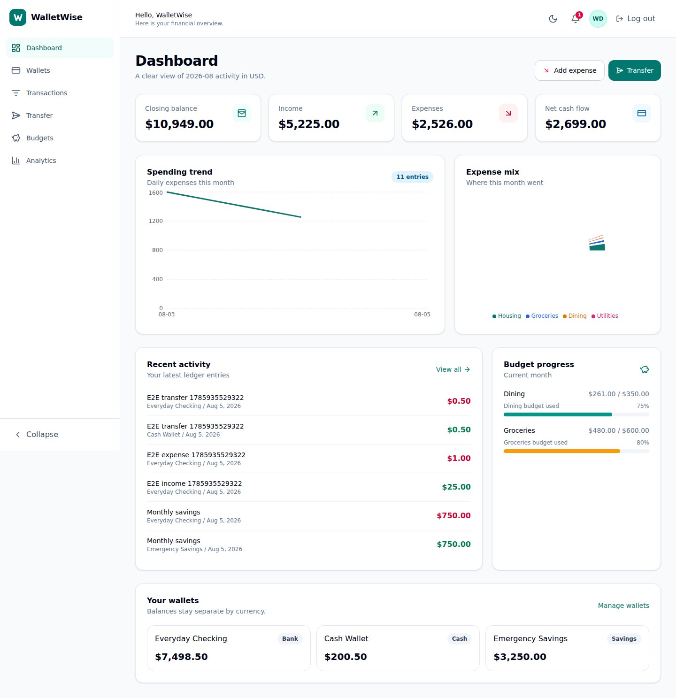
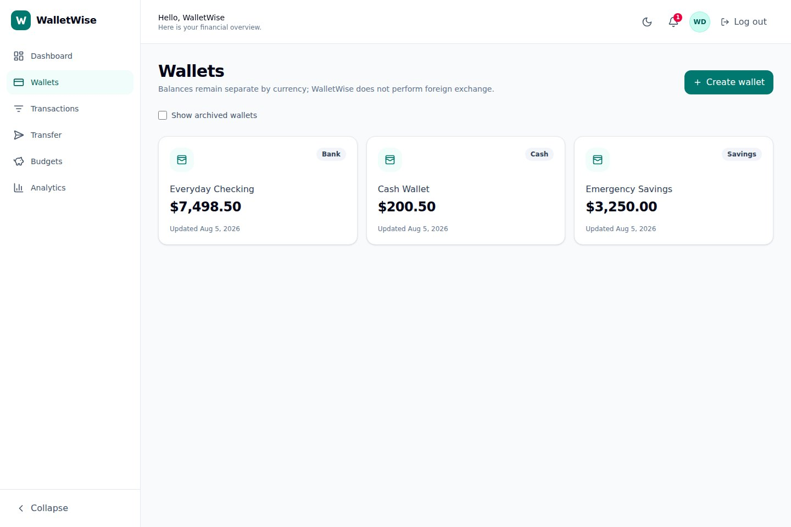
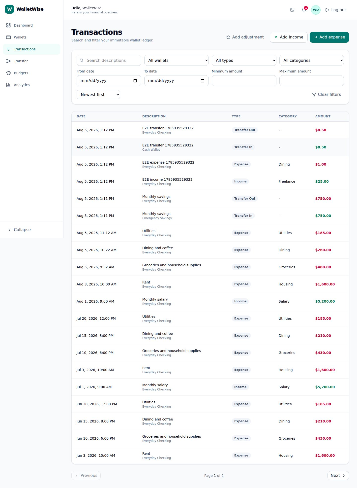
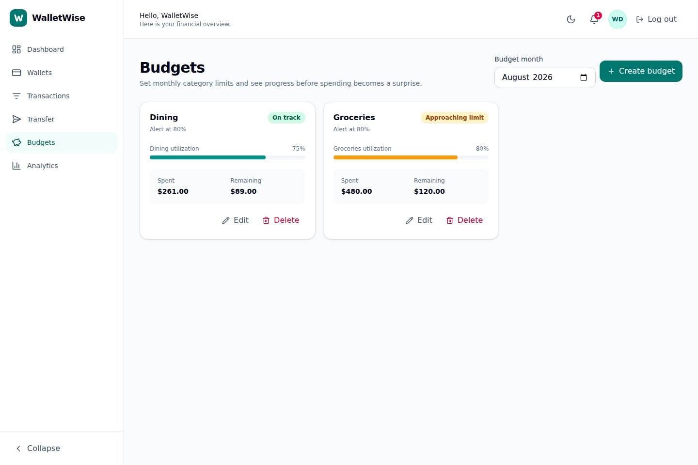
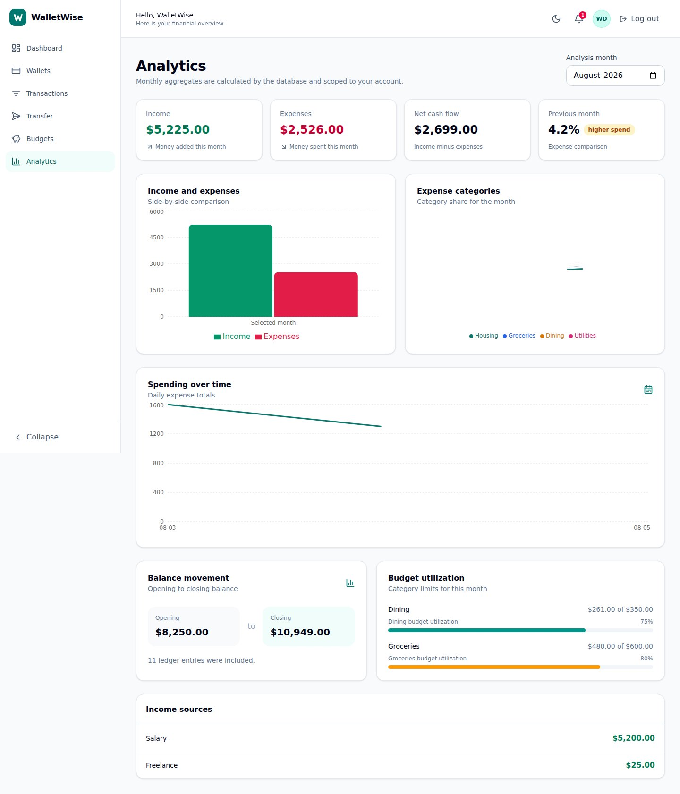
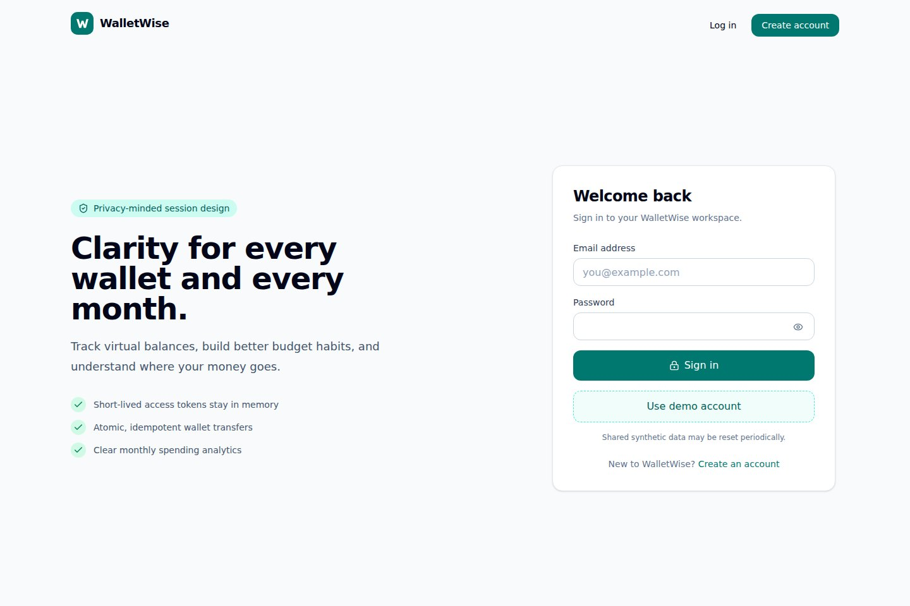
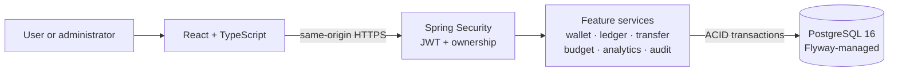
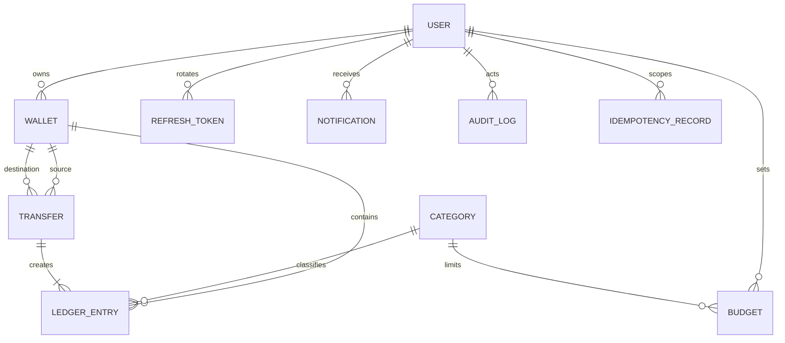
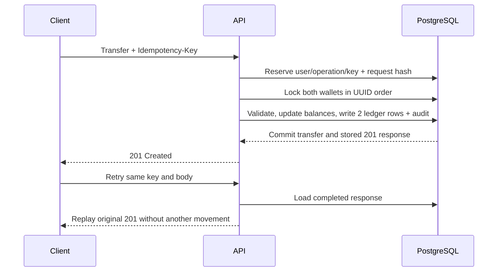

<p align="center">
  
</p>

<h1 align="center">WalletWise</h1>

<p align="center">
  A secure digital wallet and expense-management platform built with Java 21,
  Spring Boot, React, TypeScript, and PostgreSQL.
</p>

<p align="center">
  <a href="https://github.com/KonkalaSudheerReddy/walletwise-platform/actions/workflows/ci.yml"></a>
  <a href="https://github.com/KonkalaSudheerReddy/walletwise-platform/actions/workflows/codeql.yml"></a>
  <a href="https://github.com/KonkalaSudheerReddy/walletwise-platform/actions/workflows/pages.yml"></a>
  <a href="https://codespaces.new/KonkalaSudheerReddy/walletwise-platform?quickstart=1"></a>
  <a href="LICENSE"></a>
</p>

WalletWise lets users create virtual wallets, record income and expenses,
transfer virtual funds, set monthly category budgets, receive threshold alerts,
search ledger history, and understand monthly financial activity. It is a
portfolio and educational application designed to demonstrate transaction
consistency, persistent idempotency, security boundaries, testing, and modern
delivery—not a real-money product.

> **Verified status:** the [GitHub Pages showcase](https://konkalasudheerreddy.github.io/walletwise-platform/)
> is live, and the [GHCR image](https://github.com/KonkalaSudheerReddy/walletwise-platform/pkgs/container/walletwise-platform)
> is anonymously pullable. GitHub Actions verifies the backend, frontend,
> PostgreSQL integration tests, production image, API workflow, browser journey,
> and CodeQL analysis. The Render/Neon application has not been provisioned
> because provider credentials are unavailable, so no public application,
> Swagger, or health endpoint is claimed.

| Project resource | Link |
|---|---|
| Portfolio showcase | [Open GitHub Pages](https://konkalasudheerreddy.github.io/walletwise-platform/) |
| Automated verification | [View GitHub Actions](https://github.com/KonkalaSudheerReddy/walletwise-platform/actions) |
| Container package | [Open GHCR package](https://github.com/KonkalaSudheerReddy/walletwise-platform/pkgs/container/walletwise-platform) |
| Versioned source | [Open the latest release](https://github.com/KonkalaSudheerReddy/walletwise-platform/releases/latest) |
| Cloud development | [Create a Codespace](https://codespaces.new/KonkalaSudheerReddy/walletwise-platform?quickstart=1) |

## Why this project is interesting

- **Atomic two-wallet transfers:** both balances, two linked ledger entries, the
  transfer record, audit event, and idempotent response commit or roll back
  together.
- **Safe retries:** a caller-scoped `Idempotency-Key` is persisted with a
  canonical request hash. An identical retry replays the original `201`; key
  reuse for another body returns `409`.
- **Concurrency control:** wallet rows are locked in deterministic UUID order so
  competing transfers validate the latest committed balance.
- **Practical sessions:** short-lived JWT access tokens stay in browser memory;
  opaque refresh tokens are hashed, rotated, revoked, and sent in an HttpOnly
  cookie.
- **Ownership by construction:** protected queries combine a resource ID with
  the authenticated owner ID, while method security enforces `USER` and `ADMIN`
  roles.
- **Production-minded delivery:** Flyway migrations, PostgreSQL/Testcontainers,
  full-stack Playwright coverage, a non-root multi-stage image, Compose, GitHub
  Actions, Codespaces, Pages, and Render/Neon configuration.

## Product tour

These screens are captured automatically from the production Docker image after
the full API and browser smoke journeys pass.

| Dashboard | Wallets |
|---|---|
|  |  |
| Transactions | Budgets |
|  |  |
| Analytics | Sign in |
|  |  |

## Demo account

The synthetic demo profile rebuilds this account deterministically:

```text
Email:    demo@walletwise.app
Password: Demo@12345
```

It exists only when `APP_DEMO_SEED_ENABLED=true` or the demo profile is active.
Its synthetic wallets, ledger, budgets, and analytics are refreshed at startup
so relative-month dates and every immutable `balanceAfter` value stay coherent.
Never use the demo profile or known credentials for private or real financial
data.

## Technology stack

| Layer | Technology |
|---|---|
| Backend | Java 21, Spring Boot 4.1, Spring MVC, Spring Security, Spring Data JPA, Bean Validation |
| Security | JWT access tokens, opaque refresh tokens, BCrypt, method security, RFC 7807 problems |
| Data | PostgreSQL 16, Flyway, UUID keys, fixed-precision money, JPA Specifications/projections |
| Frontend | React 19, TypeScript, Vite, React Router, TanStack Query/Table, React Hook Form, Zod |
| UI | Tailwind CSS, accessible reusable components, Recharts, Lucide icons |
| Testing | JUnit 5, Spring integration tests, Testcontainers, Vitest, Testing Library, Playwright |
| Delivery | Docker, Docker Compose, GitHub Actions, GHCR, Codespaces, Pages, Render blueprint |

## Architecture

WalletWise is a modular monolith. Feature boundaries stay clear in code while
one Spring Boot process and one PostgreSQL database keep transactions and
operations understandable.



During development, Vite runs on port `5173` and proxies requests to Spring Boot
on `8080`. The production image compiles React into Spring Boot's static
resources, so the UI and `/api/v1` share one origin. Browser-route fallback does
not intercept API, Actuator, Swagger, or OpenAPI paths.

[Read the complete architecture guide](docs/ARCHITECTURE.md).

## Database model



Every balance mutation appends a ledger entry in the same transaction. Ledger
records have no public update or delete API; corrections are explicit
adjustments. Flyway owns constraints and indexes, while Hibernate validates the
resulting schema.

[See tables, indexes, constraints, and locking details](docs/DATABASE_DESIGN.md).

## Transfer and idempotency flow

`POST /api/v1/transfers` requires `Idempotency-Key`:



The unique database constraint closes concurrent races. A separate wallet lock
protects different transfer keys that still compete for the same balance.

## Quick start with Docker

Prerequisites: Docker Desktop or Docker Engine with Compose v2.

```bash
git clone https://github.com/KonkalaSudheerReddy/walletwise-platform.git
cd walletwise-platform
docker compose up --build
```

Or use the helper:

```bash
./scripts/run-local.sh
```

```powershell
.\scripts\run-local.ps1
```

| Local resource | URL |
|---|---|
| Application | <http://localhost:8080> |
| Swagger UI | <http://localhost:8080/swagger-ui/index.html> |
| OpenAPI JSON | <http://localhost:8080/v3/api-docs> |
| Health | <http://localhost:8080/actuator/health> |
| Info | <http://localhost:8080/actuator/info> |

PostgreSQL data is kept in a named development volume. `docker compose down`
stops the stack without deleting it.

## Open in Codespaces

The included dev container installs Java 21, Node.js 24, and its own Docker
engine. It builds and starts WalletWise automatically, then forwards ports 8080,
5173, and 5432.

[Create a WalletWise Codespace](https://codespaces.new/KonkalaSudheerReddy/walletwise-platform?quickstart=1)
and wait for the **WalletWise application** port to open in a separate browser
tab. No local installation or terminal command is required. If the tab does not
open, use **Ports > 8080 > Open in Browser**; the embedded editor preview is
intentionally blocked by the application's anti-framing security header.

To restart the application later, run:

```bash
docker compose up --build --detach
```

If an older Codespace reports `docker: command not found`, pull the latest
`main` branch and select **Codespaces: Rebuild Container** from the command
palette, or create a fresh Codespace from the link above.

Codespaces requires a signed-in GitHub account, available entitlement, and
usage quota. The public link does not contain or require a project secret.

## Native development

Prerequisites are Java 21, Node.js 20.19 or newer, npm, and PostgreSQL 16.
Configure the database variables from `.env.example`, then start Spring Boot:

```bash
./backend/mvnw -f backend/pom.xml spring-boot:run
```

In another terminal, start Vite:

```bash
npm ci --prefix frontend
npm run dev --prefix frontend
```

Open <http://localhost:5173>. Vite proxies `/api`, `/actuator`, `/v3/api-docs`,
and `/swagger-ui` to <http://localhost:8080>.

## Environment variables

Copy `.env.example` to an ignored `.env` only when a local tool needs it. The
example values are development placeholders, not production credentials.

| Variable | Purpose | Production rule |
|---|---|---|
| `SPRING_PROFILES_ACTIVE` | Select `dev`, `prod`, and optional `demo` behavior | Use `prod`; enable `demo` only for the synthetic portfolio instance |
| `SPRING_DATASOURCE_URL` | PostgreSQL JDBC connection | Require TLS for hosted PostgreSQL |
| `SPRING_DATASOURCE_USERNAME` / `PASSWORD` | Database role | Store only in provider secrets |
| `JWT_SECRET` | Signs access JWTs | At least 32 unpredictable characters; development prefixes are rejected |
| `APP_CORS_ALLOWED_ORIGINS` | Explicit native-development browser origins | No wildcard with credentials |
| `APP_COOKIE_SECURE` | Controls HTTPS-only refresh cookie | Must be `true` when hosted |
| `APP_DEMO_SEED_ENABLED` | Enables idempotent synthetic data | Never use with private or real data |
| `APP_ADMIN_EMAIL` / `PASSWORD` | Optional administrator seed | Leave unset unless deliberately configured; password is secret |
| `APP_PUBLIC_URL` | Canonical hosted same-origin URL | Set only after the deployment URL exists |
| `PORT` | HTTP listener | Hosting platform supplies it; local default is 8080 |

The production profile refuses insecure signing-secret configuration. No secret
is baked into the Docker image or committed to the repository.

## API overview

Public authentication endpoints support registration, login, refresh, and
logout. Authenticated users work with categories, wallets, immutable
transactions, transfers, budgets, analytics, and notifications. Administrator
routes list users and sanitized audit events, change account status, and trigger
budget-alert evaluation.

Transaction history supports wallet, type, category, date, amount, and
description filters plus bounded server-side pagination and sorting. Expected
errors use RFC 7807 `application/problem+json` with a safe detail and correlation
ID.

- [API guide and curl examples](docs/API_GUIDE.md)
- [Postman collection](postman/WalletWise.postman_collection.json)
- [Local Postman environment](postman/WalletWise.local.postman_environment.json)

## Security model

- BCrypt password hashes and normalized unique emails;
- short-lived JWT access tokens with user UUID subject and role;
- random opaque refresh tokens stored only as hashes and rotated on use;
- HttpOnly, SameSite, restricted-path refresh cookies (`Secure` in production);
- method security plus owner-scoped queries for every user resource;
- explicit CORS origins and same-origin production delivery;
- correlation IDs, sanitized logs, and append-only audits without credentials;
- safe Actuator exposure and RFC 7807 errors without stack traces; and
- environment/provider secret management with production validation.

[Review threat assumptions and remaining risks](docs/SECURITY_DESIGN.md).

## Testing

Run the complete local quality gate:

```bash
./scripts/verify.sh
```

```powershell
.\scripts\verify.ps1
```

With the application running, verify the end-to-end API behavior:

```bash
./scripts/verify-api.sh
```

```powershell
.\scripts\verify-api.ps1
```

The test strategy includes JUnit service tests, MockMvc security and validation
tests, PostgreSQL/Testcontainers migration and concurrency tests, Vitest and
Testing Library component tests, and a Playwright full-stack smoke flow.

[Read commands, coverage boundaries, and release evidence](docs/TESTING.md).

## Delivery

GitHub Actions defines four independent concerns:

- `CI` runs backend verification, frontend formatting/lint/tests/build, and the
  production Docker build on main and pull requests;
- `Docker publish` publishes main and semantic-version images to GHCR with SBOM
  and provenance;
- `Pages` publishes only the static project showcase; and
- `CodeQL` analyzes Java and JavaScript/TypeScript on changes and a schedule.

`render.yaml` provides a secret-free Docker Blueprint for one Render web
service. Neon supplies a pooled TLS PostgreSQL connection. Provider credentials
must be entered through their authenticated dashboards; this repository does
not contain them. Free hosting can sleep after inactivity and has plan-specific
cold-start and usage limits.

[Follow the exact Docker, GHCR, Render, Neon, Pages, and Codespaces procedure](docs/DEPLOYMENT.md).

## Repository layout

```text
backend/        Spring Boot application and tests
frontend/       React application and Playwright tests
showcase/       Accessible static project page for GitHub Pages
docs/           Architecture, data, security, testing, deployment, ADRs
postman/        Collection and secret-free local environment
scripts/        Bash and PowerShell run/verification helpers
.devcontainer/  Java 21, Node 24, and Docker-enabled Codespace
.github/        CI/CD, CodeQL, Pages, Dependabot, and templates
```

## Design records

- [ADR 0001: Use a modular monolith](docs/adr/0001-use-modular-monolith.md)
- [ADR 0002: Use persistent idempotency for transfers](docs/adr/0002-use-persistent-idempotency-for-transfers.md)
- [ADR 0003: Use JWT access and opaque refresh tokens](docs/adr/0003-use-jwt-access-and-opaque-refresh-tokens.md)
- [ADR 0004: Serve React from Spring Boot in production](docs/adr/0004-serve-react-from-spring-boot-in-production.md)

## Limitations

- Virtual balances only: no bank connection, real payments, stored funds, or
  financial advice.
- Transfers require equal currencies; there is no currency-conversion engine.
- No MFA, email verification, password-reset delivery, or immediate distributed
  revocation of every already-issued access JWT.
- No performance, availability, legal-compliance, or security-certification
  claim.
- A free hosted demo can have cold starts and provider usage limits.

## Roadmap

- Accessibility audit and expanded responsive browser coverage;
- account verification, password reset, MFA, and device/session management;
- reconciliation reports, restore drills, and stronger operational dashboards;
- notification delivery beyond the in-app inbox;
- measured performance testing and index tuning; and
- multi-currency support only with explicit exchange-rate and rounding design.

## Portfolio disclaimer

WalletWise uses synthetic demonstration data and is intended to show software
engineering decisions. It is not bank-grade, production-certified, legally
compliant, or suitable for holding or transferring real money.

For concise interview explanations and four evidence-based resume bullets, see
[RESUME_AND_INTERVIEW_GUIDE.md](docs/RESUME_AND_INTERVIEW_GUIDE.md).

## License

Copyright © 2026 Konkala Sudheer Reddy. Released under the [MIT License](LICENSE).
