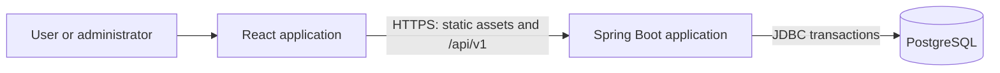
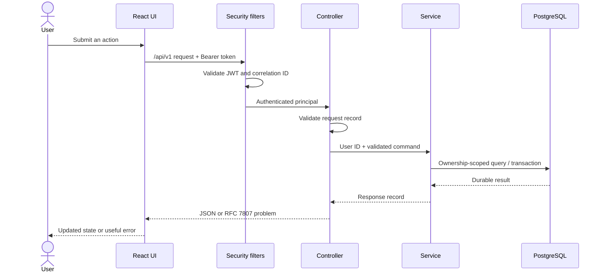
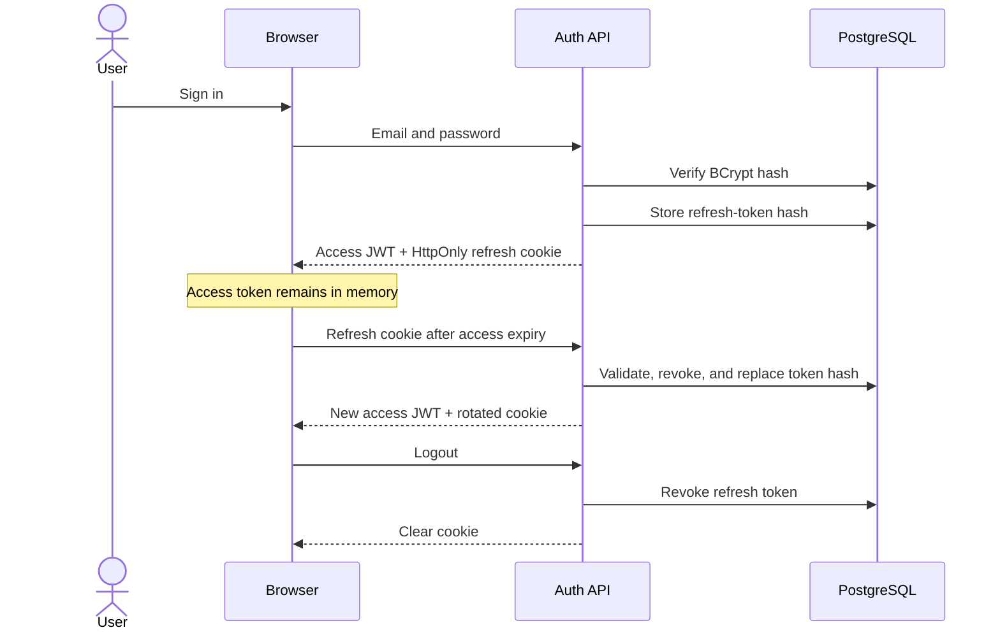
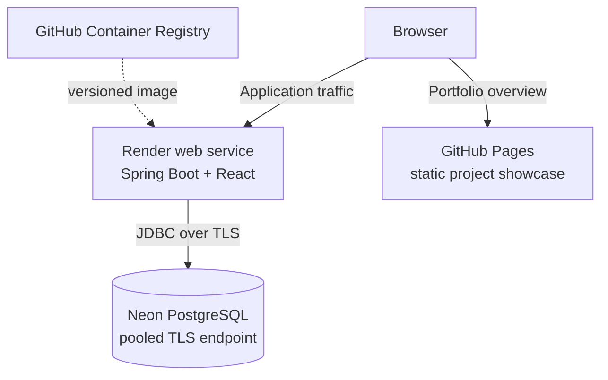

# WalletWise architecture

WalletWise is a modular monolith: one Spring Boot application owns the backend
modules, serves the compiled React application in production, and connects to
one PostgreSQL database. The boundaries are explicit in code, but deployment
and operations remain understandable for a small team and for an interview.

## System context



The application handles virtual balances only. There are no banks, payment
processors, foreign-exchange services, queues, or third-party financial data
providers in version 1.

## Repository and runtime boundaries

```text
frontend/               React and TypeScript source
backend/                Spring Boot modular monolith
showcase/               Standalone static GitHub Pages project page
postman/                Versioned API examples
docs/                   Design and operations documentation
scripts/                Cross-platform run and verification helpers
Dockerfile              Production image assembly
compose.yaml            Application plus local PostgreSQL
```

During native development, Vite runs at port `5173` and proxies API and
documentation requests to Spring Boot at port `8080`. The production image
builds the React assets and places them on Spring Boot's classpath. One process
then serves both the single-page application and the API from the same origin.

## Backend modules

Backend packages are organized by feature under `com.walletwise`. Controllers
translate HTTP concerns, services own transaction boundaries and business
rules, repositories perform scoped persistence operations, and API records keep
JPA entities out of the public contract.

| Module | Responsibility |
|---|---|
| `auth` and `security` | Registration, login, JWT access tokens, opaque refresh-token rotation, logout, and authorization |
| `user` | Profile, role, enabled state, currency preference, and ownership identity |
| `wallet` | Wallet lifecycle, balance state, archive and restore behavior |
| `category` | Default income and expense classification |
| `ledger` | Immutable ledger entries, filters, sorting, and pagination |
| `transfer` | Atomic two-sided transfer and persistent idempotency |
| `budget` | Monthly limits, utilization, and alert evaluation |
| `notification` | User-facing alert inbox and read state |
| `analytics` | Monthly projections and aggregate queries |
| `audit` | Append-only security and business audit events |
| `admin` | Explicitly authorized operational endpoints |
| `common`, `config` | Problem details, correlation IDs, time, persistence, and framework configuration |

These are source-code boundaries rather than separately deployed services. A
feature can call another feature's service through a narrow Java interface when
a single business transaction spans both features.

## Request flow



The authenticated user ID comes from the access token, never from a trusted
request-body field. Repository or service queries combine the resource ID with
the owner ID so knowing another UUID is not sufficient to access it.

## Authentication flow



The refresh token is an opaque random value. Only a one-way hash is persisted.
The short-lived access JWT carries the user ID and role and is not stored in
browser persistence.

## Transfer consistency

A transfer is intentionally contained in one database transaction:

1. Reserve or load an idempotency record scoped by user and operation.
2. Compare the canonical request hash if the key already exists.
3. Load and lock both wallets in deterministic UUID order.
4. Enforce ownership, different wallets, matching currencies, positive amount,
   and sufficient balance for a non-credit source.
5. Update both wallet balances.
6. Insert `TRANSFER_OUT` and `TRANSFER_IN` ledger entries linked to the transfer.
7. Complete the transfer, audit event, and stored idempotent response.
8. Commit once. Any exception rolls the complete unit back.

The database unique constraint is the last line of defense for concurrent use
of the same idempotency key. Wallet row locks serialize conflicting balance
updates without introducing a distributed lock.

## Frontend organization

The frontend uses feature-oriented TypeScript modules, React Router for public,
protected, and administrator routes, TanStack Query for server state, React
Hook Form and Zod for form validation, and a centralized API client for token
refresh and RFC 7807 errors. The short-lived access token exists only in memory.
One failed request may be retried after a successful refresh; refresh requests
are guarded against loops.

## Production asset delivery

The Docker build has distinct dependency/build stages and a Java 21 runtime
stage. Compiled frontend assets become Spring Boot static resources. A fallback
controller serves `index.html` for browser routes but excludes `/api/**`,
`/actuator/**`, `/swagger-ui/**`, and `/v3/api-docs/**`. This same-origin model
keeps production cookies and CORS behavior straightforward.

## Deployment topology



Render and Neon are the documented deployment targets, not required runtime
dependencies for local development. No hosted application URL is claimed until
provider authentication and end-to-end verification are complete.

## Tradeoffs

- **Modular monolith over microservices:** preserves transactional consistency
  and simple operations while still demonstrating feature boundaries.
- **Stored balance plus immutable ledger:** makes reads efficient, but every
  balance mutation must share the transaction that writes its ledger entry.
- **JWT access plus opaque refresh token:** limits database work on ordinary API
  calls while retaining server-side session revocation and rotation.
- **PostgreSQL idempotency over an in-memory cache:** remains correct across
  restarts and multiple application instances at the cost of an extra durable
  record per protected operation.
- **Same-origin production delivery:** reduces deployment and cookie complexity,
  but the frontend and backend are released together.
- **Synchronous request processing:** is appropriate for this project size;
  queues and distributed workflows would add operational cost without a current
  requirement.
