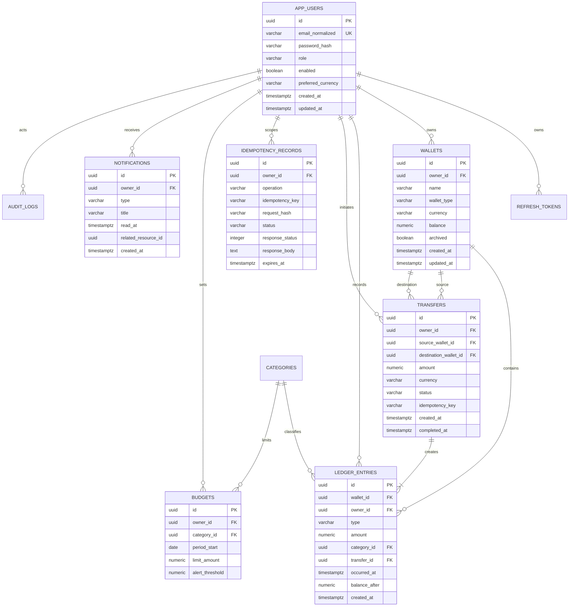

# Database design

PostgreSQL is the durable source of truth. Flyway migrations create every table,
constraint, and index; normal application startup uses
`spring.jpa.hibernate.ddl-auto=validate` so entity drift fails fast instead of
changing production data implicitly.

The exact migration files are authoritative. This document explains the
relational model and its consistency rules.

## Entity relationship diagram



## Table purposes and invariants

| Table | Purpose | Important invariants |
|---|---|---|
| `app_users` | Identity, role, status, and preference root | Normalized email is unique; password is BCrypt hash; role is constrained |
| `refresh_tokens` | Revocable server-side session state | Only token hashes are stored; expiry and revocation are indexed; rotation links are optional |
| `wallets` | Current virtual balance and wallet lifecycle | Owner is required; currency is an ISO code; money is fixed precision; archived wallets remain referentially valid |
| `categories` | Shared default income or expense classification | Direction and normalized name are constrained and unique together |
| `ledger_entries` | Append-only financial ledger | Amount is positive; direction comes from type; public API has no update or delete |
| `transfers` | Business record for a two-wallet movement | Source differs from destination; currency and amount are immutable after completion |
| `idempotency_records` | Durable retry coordination and response replay | `(owner_id, operation, idempotency_key)` is unique; request hash detects key misuse |
| `budgets` | User/category limit for a calendar month | One active row per owner, category, year, and month; amount and threshold are valid |
| `notifications` | Deduplicated user alert inbox | Ownership and read state are indexed; budget alert identity prevents repeat messages |
| `audit_logs` | Append-only record of meaningful actions | No credential material; actor may be null for safe system events; metadata is non-sensitive JSON |

## Money and time

All monetary columns use an explicitly sized PostgreSQL `numeric` type and map
to Java `BigDecimal`. Float and double are never used for balances or amounts.
Values have a defined scale and are rounded only at an input or reporting
boundary, not during arbitrary intermediate calculations.

Timestamps use `timestamptz` and are written in UTC. Services that depend on the
current instant receive an injected `java.time.Clock`, which keeps expiry,
scheduling, and month-boundary tests deterministic.

## Constraints

Database constraints complement Java validation:

- unique normalized user email;
- positive transaction, transfer, and budget amounts;
- three-character supported currency codes;
- valid enum values through checks or database-compatible enum mapping;
- source and destination wallet inequality;
- unique user/category/month budget;
- unique caller/operation/idempotency-key tuple;
- required ownership and foreign keys; and
- bounded month and alert-threshold values.

Cross-row rules such as sufficient balance or matching wallet currency remain
service checks performed while the rows are locked.

## Index strategy

Indexes follow actual query shapes instead of indexing every column:

- wallets by `(owner_id, archived, created_at)`;
- ledger entries by `(owner_id, occurred_at desc, id)` and
  `(wallet_id, occurred_at desc, id)`;
- transaction type and category combined with owner and occurred time where
  filtering selectivity warrants it;
- transfers by `(owner_id, created_at desc)`;
- refresh-token hash plus expiry/revocation cleanup fields;
- idempotency unique lookup plus `expires_at` for cleanup;
- budgets by `(owner_id, period_start desc)`;
- notifications by unread partial index and `(owner_id, created_at desc)`; and
- audits by timestamp, actor, action, and resource where administrator filters
  use them.

Description search uses a bounded, case-insensitive database predicate. The API
caps page size at 100 and does not load the complete ledger into application
memory.

## Ledger immutability and balance consistency

An opening balance inserts an `OPENING_BALANCE` entry. Income, expense, transfer,
and adjustment paths all update the stored wallet balance in the same database
transaction that appends the corresponding ledger entry. The public API does
not edit or delete ledger rows; a correction is another explicit entry.

The stored balance is therefore a read optimization with a strict invariant:

```text
wallet balance = opening + income + transfer-in - expense - transfer-out +/- adjustments
```

Integration tests verify this invariant after success and after forced rollback.

## Transfer row locking

For a transfer, both wallet UUIDs are sorted before the repositories request
pessimistic write locks. Every concurrent transfer follows the same lock order,
which reduces deadlock risk. Once locked, the service revalidates ownership,
archive status, currency, and funds before changing state.

PostgreSQL holds these row locks until commit or rollback. A second transfer
touching either wallet waits, then observes the committed balance before its own
validation. The idempotency unique constraint separately prevents duplicate
execution of the same caller/key pair.

## Migrations and seed data

Migrations are forward-only, versioned, and safe on an empty or existing
database. Synthetic demo data is enabled only through an explicit demo setting
and is inserted idempotently. Restarting the application must not duplicate the
demo user, wallets, budgets, ledger entries, notifications, or audit data.
