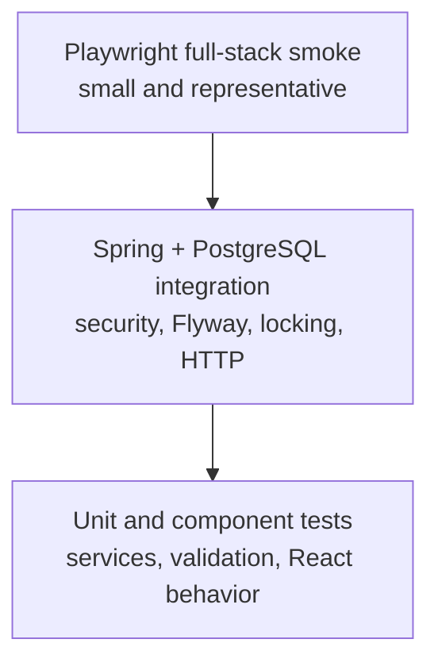

# Testing WalletWise

WalletWise uses layered tests because no single test style proves the important
properties. Fast unit and component tests provide feedback; PostgreSQL-backed
integration tests prove persistence and concurrency; the full-stack smoke test
checks that the packaged system works from the browser.

This document lists the required checks. A command must be executed successfully
before its result is described as passing in a release or README badge.

## Test pyramid



## Complete verification

From the repository root:

```bash
./scripts/verify.sh
```

On Windows PowerShell:

```powershell
.\scripts\verify.ps1
```

These commands run backend verification, install the locked frontend dependency
tree, check formatting, lint, test and build the frontend, validate Compose, and
build the production image. Use `--skip-docker` or `-SkipDocker` only when a
Docker daemon is deliberately unavailable; that is not a complete release
verification.

## Backend tests

Run the Maven lifecycle with the committed wrapper:

```bash
./backend/mvnw -B -ntp -f backend/pom.xml clean verify
```

```powershell
.\backend\mvnw.cmd -B -ntp -f backend\pom.xml clean verify
```

The backend suite is expected to cover:

- pure service rules such as money validation, currency restrictions, and
  budget utilization;
- deterministic expiry and month behavior through an injected `Clock`;
- request validation and RFC 7807 controller errors;
- unauthenticated, cross-user, disabled-user, `USER`, and `ADMIN` authorization;
- ownership-scoped repository queries, filtering, sorting, and pagination;
- Flyway migrations against PostgreSQL;
- refresh-token hashing, rotation, revocation, and cookie attributes;
- audit and correlation-ID redaction behavior; and
- demo seeding idempotency.

Mockito is useful at narrow boundaries, but tests should not mock JPA behavior
that is material to correctness.

## PostgreSQL and Testcontainers

Database integration tests use a PostgreSQL Testcontainer rather than an H2
substitute. This exercises the same constraints, numeric behavior, locking, SQL
dialect, and Flyway migrations as the application. A running Docker daemon is
therefore required for the complete Maven verification lifecycle.

Important transfer cases include:

1. successful movement and two linked ledger entries;
2. insufficient balance with no partial changes;
3. different users, different currencies, and identical source/destination;
4. identical retry returning the stored response without a second movement;
5. same idempotency key with a different canonical body returning `409`;
6. concurrent duplicate requests creating one transfer;
7. forced internal failure rolling back balances, ledger, transfer, and audit;
8. concurrent transfers against the same wallet serializing correctly; and
9. deterministic wallet lock ordering to reduce deadlocks.

Concurrency tests coordinate threads with barriers or latches and assert final
database state. They do not rely on arbitrary sleeps.

## Frontend tests

Install and verify the locked frontend:

```bash
npm ci --prefix frontend
npm run format:check --prefix frontend
npm run lint --prefix frontend
npm run test --prefix frontend
npm run build --prefix frontend
```

Vitest and React Testing Library cover form validation, protected and
administrator routes, refresh/error states, loading and empty states, and key
dashboard behavior. Tests interact through accessible roles and labels where
possible rather than component implementation details. The production build is
also the strict TypeScript check because it runs `tsc -b` before Vite.

## Playwright full-stack smoke

Start the production-style stack with demo data:

```bash
docker compose up --build --detach
npm run test:e2e --prefix frontend
```

`PLAYWRIGHT_BASE_URL` defaults to `http://localhost:8080` and can target a
different verified environment. The serial smoke flow signs in with the
synthetic demo account, opens the dashboard, creates or selects wallets, records
income and expense, transfers funds, inspects the ledger and analytics, and
logs out. Each run creates unique synthetic identifiers and must not depend on
existing remote data or test ordering.

Install the Playwright browser when required by a new workstation or CI runner:

```bash
npx --prefix frontend playwright install --with-deps chromium
```

## API smoke and idempotency verification

With the stack running, use the matching script for the current shell:

```bash
./scripts/verify-api.sh
```

```powershell
.\scripts\verify-api.ps1
```

The script performs health and authentication checks, creates two isolated
wallets, records income, sends and repeats a transfer with one idempotency key,
checks conflicting key reuse, queries filtered paginated ledger entries, and
requests monthly analytics. It exits nonzero on an unexpected status or a
duplicate balance movement. Tokens are held only in process memory and are not
printed.

In CI, the smoke account uses a run-scoped synthetic email. The stack then
restarts only the application container and runs
`scripts/verify-persistence.mjs`, proving that the smoke wallets and balances
survive in PostgreSQL when a fresh application container starts. It also proves
that demo reseeding rebuilds exactly one deterministic set of wallets, ledger
entries, and transfers rather than duplicating them.

The Postman collection provides the same flow interactively. A cookie jar is
required for refresh and logout behavior.

## Manual responsive and accessibility checks

Before screenshots or a release, inspect at least phone, tablet, and desktop
widths. Verify keyboard navigation, visible focus, labeled controls, dialog
focus management, chart alternatives, color contrast, reduced-motion behavior,
error announcements, and useful loading and empty states. A passing component
test does not replace this inspection.

## Screenshot capture

After the full application works with the synthetic demo profile and Playwright's
Chromium browser is installed, capture the six repository images with:

```bash
node scripts/capture-screenshots.mjs
```

The script uses a fixed desktop viewport, reduced motion, UTC, and the demo
account. It writes optimized JPEGs under `docs/images/` without browser chrome,
developer tools, tokens, or personal information. Inspect every generated image
before committing it, then reference only those verified captures from the
README and showcase.

## Release evidence

Record the commit SHA and results for:

- Maven clean verify and quality checks;
- frontend format, lint, tests, and production build;
- production Docker build and Compose startup;
- health, Swagger, and API smoke behavior;
- restart/persistence and non-duplicating demo seed;
- Playwright smoke and screenshot capture; and
- hosted health, login, transfer, and TLS/secure-cookie checks when deployed.

Do not reuse an old result after changing the code or dependencies.
